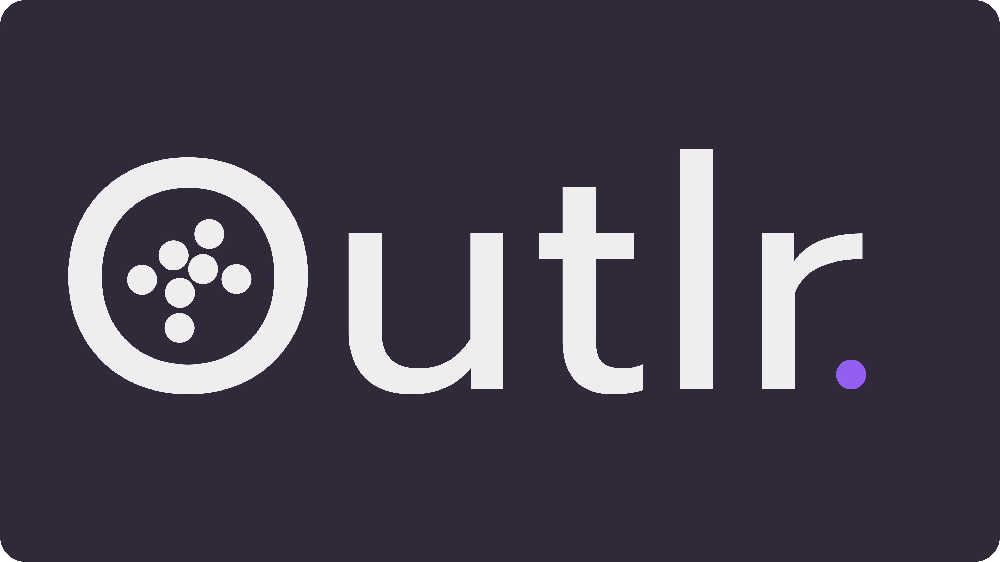

<div style="text-align:center; height: 50%">
  
</div>


# Outlr PSE Project
## Implementation
Outlr is a PSE (Praxis der Softwareentwicklung) project developed at the Karlsruhe Institute of Technology during the winter semester of 2022/23.
This repo contains the code from the implementation and quality assurance phases.
Some small changes were done after the submission deadline.

You are free to use everything in this repo.

# How to deploy

## Deploy on localhost from Docker Hub
1. Start the docker daemon
2. Go to the latest release. Under Assests > Other download the `Docker-Compose files`
3. Extract the files and go to the extracted folder
5. Set a strong `JWT_SECRET_KEY` in the `.env` file
4. Run the following command to start the app:
```sh
docker-compose up -d
```
5. Go to http://localhost:1337/
6. To stop the app run:
```sh
docker-compose down
```

## Build and deploy from source
Note: The backend IP is hardcorded in the frontend. To change it, you can follow these steps:
1. Download the source code
2. Change the `baseURL` in `frontend/src/api/AxiosClient.ts` to the new IP of the backend
3. Go to the root folder of the project and rebuild it:
```sh
docker-compose build
```
4. Start the app:
```sh
docker-compose up -d
```
